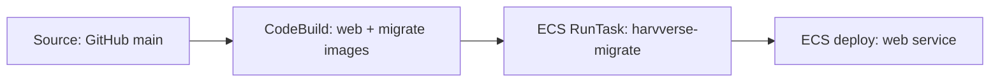

# AWS deployment handoff

Handoff for continuing Harvverse production deployment after **Phases 1–4** and **§9 migrations (manual path)**. Full blueprint: [aws-deployment-plan.md](./aws-deployment-plan.md). Infra commands: [packages/infra/README.md](../packages/infra/README.md). DB workflow: [drizzle/harvverse-workflow.md](./drizzle/harvverse-workflow.md).

**Last verified:** May 2026 — account `500501923704`, region `us-east-2`, profile **`Harvverse`**, app URL `https://defi.harvverse.farm`.

---

## Quick summary — what’s done

| Area | Status |
|------|--------|
| **Phase 1** — Next.js Docker (`standalone`, health route, Dockerfile) | Done |
| **Phase 2** — `Harvversev2Network`, `Harvversev2Ecr` | Deployed |
| **Phase 3** — `Harvversev2Data` (RDS), `Harvversev2Storage` (S3) | Deployed |
| **Phase 4** — `Harvversev2Platform` (ALB/ECS), `Harvversev2Web`, `Harvversev2Migrate` | Deployed |
| **§9 migrations** — codebase-first, migrate image, ECS task, RDS schema applied | Done (manual) |
| **Secrets** — `harvverse/prod/database`, `harvverse/prod/clerk`; `DATABASE_URL` encoding + RDS TLS pattern | Done |
| **S3 IAM** — `farm-image-storage.ts` uses task role when static keys absent | Done |
| **CI/CD pipeline** — CodePipeline, CodeBuild (web), automate migrate → deploy | **Not started** |

### Production artifacts in use

- **ECR:** `harvverse/web`, `harvverse/migrate` (tags often `latest`; prefer `{git_sha}` once CI exists)
- **ECS cluster:** `harvversev2-cluster`
- **Web service:** Fargate ARM64, 1 task, ALB + ACM for `defi.harvverse.farm`
- **Migrate task:** family `harvverse-migrate`, image runs `node ./scripts/migrate-prod.mjs`
- **RDS:** PostgreSQL 16, `db.t4g.micro`, private; credentials in `harvverse/prod/database`

### Manual deploy flow (today)

```bash
# Profile must be Harvverse (not e.g. Nimbus → different account)
pnpm docker:build:web    # needs NEXT_PUBLIC_CLERK_PUBLISHABLE_KEY at build
pnpm docker:build:migrate
# tag + push both to 500501923704.dkr.ecr.us-east-2.amazonaws.com/...
pnpm ecs:run-migrate     # exit 0 before rolling web to new image
# force ECS web service deployment if only web image changed
```

---

## What’s missing — pipeline completion

The [deployment plan §4](./aws-deployment-plan.md#4-implementation-phases) **Phases 5–7** (CI/CD) are the remaining work. Nothing in `Harvversev2Cicd` exists in CDK yet (`bin/infra.ts` stops at `MigrateStack`).

### 1. Repository — `buildspec.yml` (web)

| Item | Notes |
|------|--------|
| Root **`buildspec.yml`** | **Missing** — only `buildspec.migrate.yml` exists today |
| Build web image | `turbo prune` / `apps/web/Dockerfile`, privileged Docker |
| Push to ECR | `harvverse/web` with `$CODEBUILD_RESOLVED_SOURCE_VERSION` (and optionally `latest`) |
| Build-time env | `NEXT_PUBLIC_CLERK_PUBLISHABLE_KEY` from Secrets Manager or Parameter Store |
| Artifact | `imagedefinitions.json` for ECS deploy action |

Reference outline: [deployment plan §7.4](./aws-deployment-plan.md#74-buildspecyml-location).

### 2. CDK — `Harvversev2Cicd` (`lib/cicd-stack.ts`)

| Item | Notes |
|------|--------|
| **CodeBuild project(s)** | At minimum: web build (could be one project or web + migrate) |
| **CodePipeline** | Source: GitHub via **CodeConnections** (CodeStar), branch **`main`** |
| **IAM** | CodeBuild: ECR push, logs; `ecs:RunTask`, `ecs:DescribeTasks`, `iam:PassRole` for migration task; read build secrets |
| **Pipeline stages** | See target flow below |

Wire stack in `bin/infra.ts` with props from `PlatformStack`, `WebStack`, `MigrateStack`, `EcrStack` (cluster name, service, task definition family, subnet/SG outputs).

### 3. Pipeline stage — run migrations (plan §9.6)

After images are pushed, **before** ECS web deploy:

```bash
# Same logic as scripts/ecs/run-db-migrate.sh — can be inlined in buildspec post_build
aws ecs run-task ... harvverse-migrate ...
aws ecs wait tasks-stopped ...
# fail build if exitCode != 0
```

CodeBuild needs the migration task **execution role** pass-role and network config from `Harvversev2Migrate` outputs (`MigratePrivateSubnetIds`, `MigrateSecurityGroupId`).

### 4. Pipeline stage — deploy web

| Option | Notes |
|--------|--------|
| **ECS deploy action** | Update service with new `imagedefinitions.json` |
| **CodeDeploy to ECS** | Optional; not required for MVP |

Ensure deploy runs **only after** migrate step succeeds.

### 5. GitHub / AWS console (one-time)

- [ ] CodeConnections: authorize `harvverse-monorepo`, branch `main`
- [ ] Confirm CodePipeline trigger on push to `main`

### 6. Secrets / parameters for CI

| Item | Status |
|------|--------|
| `harvverse/prod/database` | Done — ensure `DATABASE_URL` stays URL-encoded ([§10.4](./aws-deployment-plan.md#104-database_url-and-rds-tls)) |
| `harvverse/prod/clerk` | Done for runtime |
| Parameter Store / build secrets for `NEXT_PUBLIC_*`, `CORS_ORIGIN` | May still be inlined in CodeBuild env — confirm `next build` needs |

### 7. Post-pipeline validation (checklist)

From [deployment plan §15](./aws-deployment-plan.md#15-implementation-checklist) — still open:

- [ ] Push to `main` triggers pipeline end-to-end
- [ ] Web + migrate images pushed with commit SHA
- [ ] Migration task exits 0 in pipeline
- [ ] ECS service updates; `https://defi.harvverse.farm/api/health` → 200
- [ ] Clerk sign-in E2E
- [ ] Farm image upload → S3, `storage_provider = 's3'`

### 8. Nice-to-have (not blocking MVP pipeline)

- Immutable image tags (`{git_sha}`) on task definitions instead of `latest` in `lib/config.ts`
- Remove orphan migration file `0005_proposals_message.sql` (not in `_journal.json`) or add to journal
- CloudWatch alarms (5xx, CPU, RDS storage) — plan §14 post-MVP
- Root `buildspec.yml` combining web build + migrate build + `ecs:run-migrate` + deploy in one pipeline, or separate CodeBuild projects per stage

---

## Target pipeline flow



**Order is mandatory:** migrate failure must **not** deploy a new web task.

---

## What to continue with (recommended order)

1. **Draft root `buildspec.yml`** — web image build/push; test in a standalone CodeBuild project before Pipeline.
2. **Implement `lib/cicd-stack.ts`** — CodeBuild + IAM; optionally second project or combined buildspec for migrate using `buildspec.migrate.yml` patterns.
3. **Add CodePipeline** — source connection → build → migrate run-task step → ECS deploy.
4. **Connect GitHub** in AWS console; test one push to `main`.
5. **Switch tags to `{git_sha}`** in ECS task definitions (web + migrate) via pipeline artifacts.
6. **Run post-deploy validation** checklist above.
7. **Document** in `packages/infra/README.md` that manual `pnpm ecs:run-migrate` is fallback only.

---

## Operational gotchas (don’t rediscover)

| Issue | Fix |
|-------|-----|
| `Stack Harvversev2Platform does not exist` | Wrong AWS profile/account — use **`Harvverse`** → `500501923704` |
| `Invalid URL` on migrate | URL-encode password in `DATABASE_URL` → `./scripts/aws/fix-database-url-secret.sh` |
| `SELF_SIGNED_CERT_IN_CHAIN` | Remove `?sslmode=require` from secret; TLS via code ([§10.4](./aws-deployment-plan.md#104-database_url-and-rds-tls)) |
| Migrate logs only show spinner | Container must use **`migrate-prod.mjs`**, not `drizzle-kit migrate` |
| New `latest` migrate image not used | New `ecs run-task` pulls at start — no CDK redeploy needed; **web** service needs `force-new-deployment` for new web image |

---

## Key files

| Path | Role |
|------|------|
| `packages/infra/bin/infra.ts` | CDK app entry — add `CicdStack` here |
| `packages/infra/lib/config.ts` | MVP sizing, image tags, domain, secret names |
| `packages/db/scripts/migrate-prod.mjs` | RDS/local migration apply |
| `scripts/ecs/run-db-migrate.sh` | Manual migrate (template for CodeBuild) |
| `scripts/aws/fix-database-url-secret.sh` | Fix `DATABASE_URL` after password rotation |
| `buildspec.migrate.yml` | Migrate-only build (reference for pipeline) |
| `apps/web/Dockerfile` | Web production image |

---

## Phase naming (avoid confusion)

| Name in docs | Meaning | Status |
|--------------|---------|--------|
| **§9 Phase 5** | Database migrations (ECS task, migrate image) | **Done** (manual) |
| **§4 Phase 5** | CodeBuild + `buildspec.yml` | TODO |
| **§4 Phase 6** | CodePipeline + GitHub | TODO |
| **§4 Phase 7** | Migrate + deploy wired in pipeline | TODO |

---

## Contacts / references

- Deployment blueprint: [.docs/aws-deployment-plan.md](./aws-deployment-plan.md)
- Drizzle workflow: [.docs/drizzle/harvverse-workflow.md](./drizzle/harvverse-workflow.md)
- Infra README: [packages/infra/README.md](../packages/infra/README.md)
