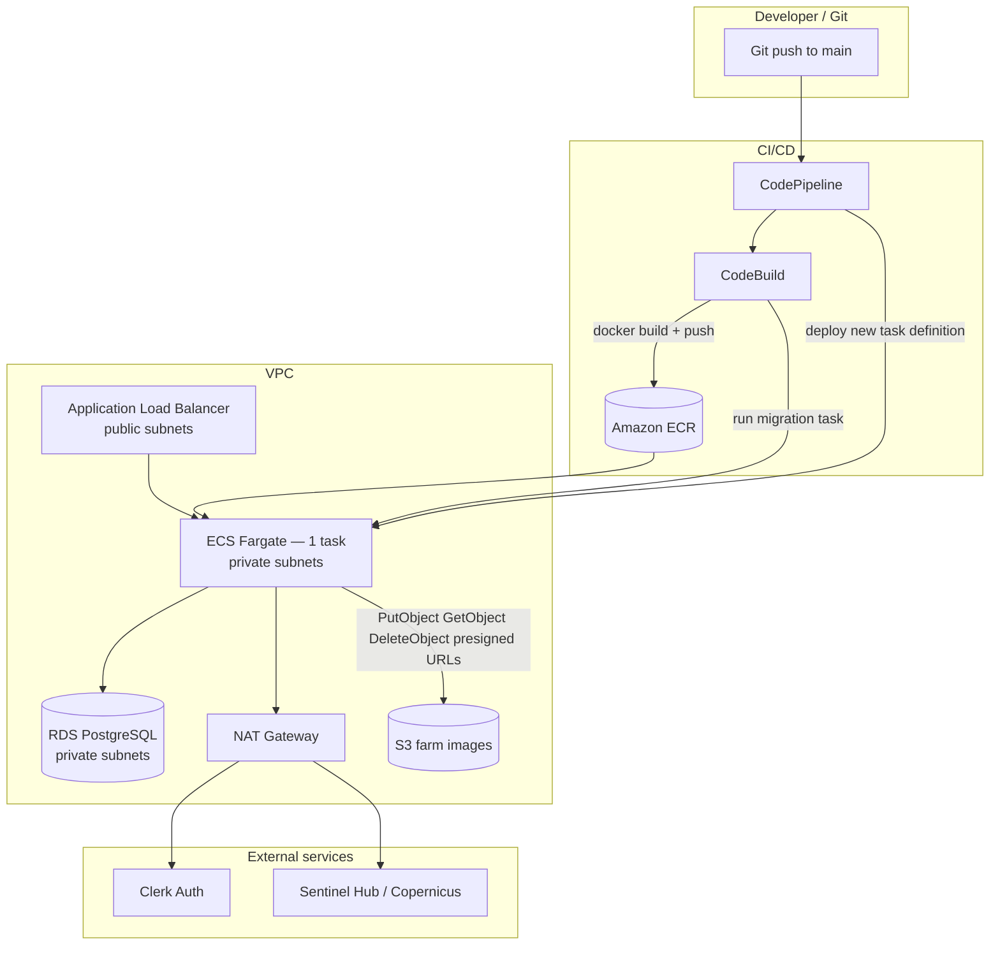
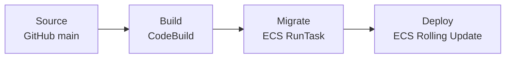
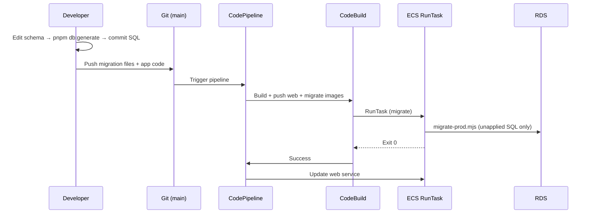

# Harvverse AWS Deployment Plan

Analysis and implementation design for self-hosting the **Next.js web app** (including its in-process tRPC API) on **ECS Fargate**, with **ECR**, **RDS PostgreSQL**, **S3** (farm image storage), **CodeBuild/CodePipeline**, and **Drizzle migrations**.

This document is the deployment blueprint for Harvverse on AWS. It reflects the monorepo as implemented in `packages/infra` (CDK stacks through **Harvversev2Migrate** deployed; **Harvversev2Cicd** not yet). Operational notes from production bring-up (RDS `DATABASE_URL`, TLS, migrate runner) are in [§9](#9-phase-5--database-migrations-codebase-first) and [§10.4](#104-database_url-and-rds-tls).

**Handoff (what’s done / what’s next for CI/CD):** [aws-deployment-handoff.md](./aws-deployment-handoff.md)

> **MVP posture:** Use the **smallest viable** configuration everywhere. Scale up (more tasks, larger instances, Multi-AZ, auto-scaling, alarms) only when traffic or reliability requirements demand it. Defaults below are **MVP-minimum**, not long-term production targets.

---

## Table of contents

1. [Goals and scope](#1-goals-and-scope)
2. [Current state analysis](#2-current-state-analysis)
3. [Target architecture](#3-target-architecture)
4. [Implementation phases](#4-implementation-phases)
5. [Phase 1 — Next.js Docker container](#5-phase-1--nextjs-docker-container)
6. [Phase 2 — ECR registry](#6-phase-2--ecr-registry)
7. [Phase 3 — CI/CD (CodeBuild + CodePipeline)](#7-phase-3--cicd-codebuild--codepipeline)
8. [Phase 4 — VPC, RDS, ECS Fargate, and S3](#8-phase-4--vpc-rds-ecs-fargate-and-s3)
9. [Phase 5 — Database migrations (codebase first)](#9-phase-5--database-migrations-codebase-first)
10. [Secrets and environment variables](#10-secrets-and-environment-variables) (incl. [§10.4 `DATABASE_URL` / RDS TLS](#104-database_url-and-rds-tls))
11. [CDK stack layout](#11-cdk-stack-layout)
12. [Repository files to add](#12-repository-files-to-add)
13. [Operational runbook](#13-operational-runbook)
14. [Risks, trade-offs, and open decisions](#14-risks-trade-offs-and-open-decisions)
15. [Implementation checklist](#15-implementation-checklist)

---

## 1. Goals and scope

### In scope

| # | Requirement | Outcome |
|---|-------------|---------|
| 1 | Docker container for the web app | Production image built from `apps/web` using Next.js self-hosting guidance |
| 2 | ECR registry + push guide | Private ECR repo, image tagging strategy, CI push instructions |
| 3 | CI/CD on `main` | CodePipeline triggered by push to `main` → build image → deploy to ECS |
| 4 | ECS Fargate + VPC + RDS | Private networking so tasks reach RDS; public ALB for HTTPS traffic |
| 5 | S3 farm images bucket | Private bucket + IAM for farm image upload/read/delete from the Next.js app (via presigned URLs) |
| 6 | RDS migrations | Codebase-first: commit generated SQL; apply via `pnpm db:migrate` (`migrate-prod.mjs`) on a one-off ECS task |

### Out of scope (for now)

- Staging environment (single production path only)
- Multi-region deployment
- High availability (Multi-AZ RDS, 2+ ECS tasks, NAT per AZ) — **deferred; see [§3.1](#31-mvp-sizing-defaults)**
- ECS auto-scaling, CloudWatch alarms, WAF, CloudFront
- Redis / shared Next.js cache (optional follow-up if ISR or `'use cache'` becomes critical)
- Contract deployment pipeline (`packages/contracts`)
- Custom domain automation beyond basic ALB + ACM (can be added incrementally)

### References

- [Next.js self-hosting guide](https://nextjs.org/docs/app/guides/self-hosting)
- [Next.js deploying guide](https://nextjs.org/docs/app/getting-started/deploying) (local copy: `node_modules/next/dist/docs/01-app/01-getting-started/17-deploying.md`)
- [Next.js Docker standalone example](https://github.com/vercel/next.js/tree/canary/examples/with-docker)
- Existing infra package: `packages/infra`
- Existing DB scripts: `packages/db` (`db:migrate`, `db:generate`, etc.)
- Drizzle migration strategy: `.docs/drizzle/migrations.md` (Option 3 reference); Harvverse workflow: `.docs/drizzle/harvverse-workflow.md`

---

## 2. Current state analysis

### Monorepo layout

```
harvverse-monorepo/
├── apps/web/              # Next.js 16 app (package name: "web") — the deployable unit
├── packages/
│   ├── api/               # Shared library: tRPC routers, context, S3 helpers (not a separate service)
│   ├── db/                # Drizzle ORM, migrations, local Postgres via docker-compose
│   ├── env/               # @t3-oss/env validation (server + web)
│   └── infra/             # AWS CDK (Harvversev2* stacks — see §11)
├── turbo.json             # build / db:* / cdk:* tasks
└── pnpm-workspace.yaml
```

### Application architecture — one process, not two services

**tRPC is owned by Next.js.** There is no standalone API service to deploy.

| Concept | Reality in this repo |
|---------|---------------------|
| HTTP entrypoint | `apps/web/src/app/api/trpc/[trpc]/route.ts` — Next.js Route Handler |
| Router definitions | `packages/api/src/routers/index.ts` — imported into the route handler |
| Why `packages/api` exists | Maintainability and portability (shared types, routers, context); code is **bundled into the Next.js server** at build time |
| Runtime | Single Node.js process: `next start` serves pages **and** `/api/trpc` |
| Deployable artifact | **One** Docker image / **one** ECS Fargate service (`apps/web`) |
| What is *not* deployed | `packages/api` has no Dockerfile, no ECR repo, and no ECS service of its own |

Request flow:

```
Browser / client
  → ALB → ECS (Next.js container)
    → pages: React Server Components / client components
    → /api/trpc/*: Route Handler → fetchRequestHandler → appRouter (from @harvverse-monorepo/api)
      → farms.uploadImage etc. → S3 / RDS (same process, same env vars, same IAM task role)
```

Infrastructure implications:

- **One ECR repository** for the web app (`harvverse/web`), not a separate API image.
- **One ECS service** behind the ALB; no internal service-to-service HTTP between “web” and “api”.
- **S3 and RDS** are backing stores accessed by the Next.js process (via library code in `packages/api` and `packages/db`).
- The **migration task** is a separate one-off ECS task (runs `packages/db/scripts/migrate-prod.mjs`), not a tRPC/API service — only DB schema changes.

### Web application characteristics

| Area | Current state | Deployment impact |
|------|---------------|-------------------|
| Framework | Next.js `^16.2.0`, App Router | Requires Node.js server (`next start`), not static export |
| Auth | Clerk (`@clerk/nextjs`, middleware in `apps/web/src/proxy.ts`) | Outbound HTTPS to Clerk; `CLERK_*` secrets required |
| API | tRPC at `/api/trpc` (Route Handler importing `@harvverse-monorepo/api`) | Same container as the UI; not a separate service |
| i18n | `next-intl` | No special infra beyond normal Next build |
| DB access | `@harvverse-monorepo/db` via `DATABASE_URL` | ECS tasks need private network path to RDS |
| File storage | **S3 required in production** (library code in `packages/api`, invoked from Next.js `/api/trpc`) | CDK `StorageStack` + ECS **web** task IAM role; avoid storing large images in RDS |
| External APIs | Sentinel Hub, Copernicus (optional env) | ECS tasks need **NAT gateway** egress from private subnets |
| Dev port | `3001` (`apps/web/package.json`) | Container should expose **`3000`** (Next default for `next start`) |
| Docker | **None** | Must add Dockerfile + `.dockerignore` |
| `next.config.ts` | No `output: "standalone"` | **Required** for minimal production images |
| Health check | **None** | Add `/api/health` for ALB and ECS |

### Database and migrations

Harvverse uses a **codebase-first** migration strategy (Drizzle **Option 3**). The TypeScript schema in `packages/db/src/schema/` is the **source of truth**; SQL is **generated** with `drizzle-kit` and **applied** with `pnpm db:migrate` (drizzle-orm migrator via `migrate-prod.mjs`). See [§9](#9-phase-5--database-migrations-codebase-first) and `.docs/drizzle/harvverse-workflow.md`.

| Item | Detail |
|------|--------|
| Strategy | **Codebase first** — schema in TypeScript → `db:generate` → commit SQL → `db:migrate` locally or on RDS via ECS |
| ORM | Drizzle ORM + `drizzle-kit` (generate/studio/push only for local) |
| Schema | `packages/db/src/schema/` (declarative `pgTable` definitions) |
| Generate command | Root: `pnpm db:generate` → `drizzle-kit generate` |
| Apply command | Root: `pnpm db:migrate` → `node packages/db/scripts/migrate-prod.mjs` |
| Migrations path | `packages/db/src/migrations/` — only files listed in `meta/_journal.json` are applied |
| Local DB | `packages/db/docker-compose.yml` (Postgres 5432) |
| Config | `packages/db/drizzle.config.ts` — `DATABASE_URL` from env; RDS hosts get `ssl: { rejectUnauthorized: false }` |
| Production `DATABASE_URL` | Secrets Manager `harvverse/prod/database` — **URL-encoded password**, **no** `?sslmode=require` in the URL (see [§10.4](#104-database_url-and-rds-tls)) |
| Local-only shortcut | `pnpm db:push` — rapid prototyping against local Docker Postgres only |
| Not used | `drizzle-kit pull`; `drizzle-kit migrate` in production containers (poor CloudWatch errors + RDS TLS issues) |

**Important:** Production and CI apply **committed migration files** via `db:migrate`, never `db:push`. Migrations must run against RDS **before** the web service deploy, never against local docker-compose in CI.

### In-process tRPC API and S3 (farm images)

Farm image logic lives in `packages/api/src/lib/farm-image-storage.ts` and is invoked by the **`farms` router** (`packages/api/src/routers/farms.ts`). That router is mounted on `appRouter` in `packages/api/src/routers/index.ts`, which the **Next.js Route Handler** at `apps/web/src/app/api/trpc/[trpc]/route.ts` imports and serves at `/api/trpc`. Client components call these procedures over HTTP to the same origin — still one Next.js app, one deployment.

| tRPC procedure | S3 operation | Behavior |
|----------------|--------------|----------|
| `farms.uploadImage` | `PutObject` | Uploads base64 image to `{prefix}/farms/{farmId}/{uuid}.{ext}`; stores bucket/key in RDS |
| `farms.deleteImage` | `DeleteObject` | Removes S3 object when `storageProvider === "s3"` |
| `farms.getImages` | `GetObject` (presigned) | Returns time-limited HTTPS URLs via `getSignedUrl` |
| Public farm views (`withPublicImages`) | `GetObject` (presigned) | Same signed URL flow for listing/detail pages |

**Object key layout:**

```
s3://{S3_FARM_IMAGES_BUCKET}/{S3_FARM_IMAGES_PREFIX}/farms/{farmId}/{uuid}.{jpg|png|webp}
```

**Current code caveat:** `getS3Config()` in `farm-image-storage.ts` returns `null` unless **both** `AWS_ACCESS_KEY_ID` and `AWS_SECRET_ACCESS_KEY` are set. In ECS, credentials should come from the **task IAM role** (default AWS SDK credential chain) with no static keys. **Before production deploy**, update `farm-image-storage.ts` so S3 is considered configured when `S3_FARM_IMAGES_BUCKET` + `AWS_REGION` are present, and only pass explicit credentials when keys are supplied (local dev).

**Fallback today:** If S3 is not configured or upload fails, images are stored as base64 in Postgres (`storageProvider: "database"`). That is acceptable for local dev but **must not** be the production path — RDS storage for binary farm images does not scale and bloats backups.

### Environment variables (from `packages/env`)

**Server (required in production):**

- `DATABASE_URL`
- `CORS_ORIGIN` (must match deployed web origin, e.g. `https://app.harvverse.com`)
- `CLERK_SECRET_KEY`

**Client (inlined at build time via `NEXT_PUBLIC_*`):**

- `NEXT_PUBLIC_CLERK_PUBLISHABLE_KEY`
- Optional contract-related `NEXT_PUBLIC_*` vars

**Required for production farm images (Next.js app → S3):**

- `S3_FARM_IMAGES_BUCKET` — bucket name (from CDK output)
- `AWS_REGION` — same region as the bucket (e.g. `us-east-2`)
- `S3_FARM_IMAGES_PREFIX` — object key prefix (default `farm-images`)
- `S3_SIGNED_URL_TTL_SECONDS` — presigned GET URL lifetime (default `900`)

**Optional server:**

- `SENTINEL_HUB_CLIENT_ID`, `SENTINEL_HUB_CLIENT_SECRET`, `CDS_API_KEY`
- `AWS_ACCESS_KEY_ID`, `AWS_SECRET_ACCESS_KEY`, `AWS_SESSION_TOKEN` — **local dev only**; production must use the ECS task IAM role (see [§8.4](#84-s3-farm-images-storagestack))

### Existing CDK infra

`packages/infra` is bootstrapped with:

- `bin/infra.ts` — wires CDK stacks with the **`Harvversev2`** prefix (see [§11.0](#110-stack-naming-convention))
- `lib/network-stack.ts`, `lib/ecr-stack.ts` — Phase 2 stacks deployed
- `lib/config.ts` — shared MVP defaults and `stackId()` / `cfnExportName()` helpers
- Scripts use `--profile Harvverse` (AWS CLI profile — not a stack name)
- Turbo tasks: `cdk:synth`, `cdk:diff`, `cdk:deploy`, etc.

**Gap:** RDS, ECS, S3, CodePipeline, and Secrets Manager stacks are not implemented yet.

### Self-hosting considerations specific to this app

From the [Next.js self-hosting guide](https://nextjs.org/docs/app/guides/self-hosting):

1. **Reverse proxy** — ALB in front of Fargate (recommended; do not expose tasks directly).
2. **Image optimization** — Works with `next start`; ensure `sharp` is available in the container (Alpine may need extra libs or use `node:20-bookworm-slim`).
3. **Proxy / middleware** — Clerk middleware runs on every matched route; ALB must support **streaming** (disable response buffering).
4. **Multi-instance settings** — **Not required for MVP** (single Fargate task). When scaling to 2+ tasks later, add `deploymentId` and `NEXT_SERVER_ACTIONS_ENCRYPTION_KEY` per the [self-hosting guide](https://nextjs.org/docs/app/guides/self-hosting#multi-server-deployments).
5. **Runtime env vars** — Server-only vars (`DATABASE_URL`, `CLERK_SECRET_KEY`) can be injected at ECS task runtime via Secrets Manager (no rebuild needed).
6. **Build-time env vars** — `NEXT_PUBLIC_*` must be present during `next build` in CodeBuild (or baked via build args).

---

## 3. Target architecture

### 3.1 MVP sizing defaults

All CDK stacks and pipeline config should start with these values. **Do not over-provision for MVP.**

| Resource | MVP default | Scale up when |
|----------|-------------|---------------|
| **ECS web service** | **1 task**, desired count = 1 | Uptime SLA, zero-downtime deploys, or CPU saturation |
| **Fargate CPU / memory** | **512 CPU / 1024 MiB** (0.5 vCPU, 1 GB) | OOM kills or sustained high CPU; bump to 1024/2048 |
| **RDS instance** | **`db.t4g.micro`** (smallest available: 0.5 vCPU, 1 GiB RAM), single-AZ | Connection limits, slow queries, storage pressure |
| **RDS storage** | **20 GB gp3** (AWS minimum for PostgreSQL), encrypted, **no storage autoscaling** | Approaching capacity |
| **RDS backups** | **1 day** retention | Compliance or recovery requirements |
| **NAT Gateway** | **1** (single AZ) | NAT AZ failure becomes unacceptable |
| **VPC subnets** | 2 AZs (ALB/RDS requirement) | No change needed at MVP |
| **VPC flow logs** | Off | Security audit requirement |
| **ECS auto-scaling** | Off | Sustained load |
| **CodeBuild** | `BUILD_GENERAL1_SMALL` | Build timeouts; then MEDIUM |
| **ECR image retention** | Last **10** images | Longer rollback window |
| **S3 lifecycle** | None | Storage cost grows |
| **Migration task** | 256 CPU / 512 MiB | N/A for drizzle migrate |
| **RDS deletion protection** | Off for MVP | Before real production data |

**MVP trade-offs (accepted):**

- Deploys cause brief downtime if the single task is replaced (rolling update with `minimumHealthyPercent: 0`, `maximumPercent: 100` is acceptable).
- RDS single-AZ: outage if AZ fails.
- One NAT: outbound internet fails if that AZ is impaired.
- No redundant app tier: one task crash = downtime until ECS restarts it.

Document a **scale-up checklist** in `packages/infra` when moving past MVP (see [§14.3](#143-scale-up-path-post-mvp)).

### High-level diagram



### Network design (VPC)

MVP layout (single production environment). **Two AZs** are still required for the ALB and RDS subnet group, but **one NAT gateway** keeps cost down:

| Layer | Subnets | Resources |
|-------|---------|-----------|
| Public (2 AZs) | `10.0.0.0/24`, `10.0.1.0/24` | ALB, **1× NAT Gateway** (single AZ) |
| Private — app (2 AZs) | `10.0.10.0/24`, `10.0.11.0/24` | ECS Fargate task(s) — **1 task for MVP** |
| Private — data (2 AZs) | `10.0.20.0/24`, `10.0.21.0/24` | RDS PostgreSQL (single-AZ for MVP) |

**Default region:** `us-east-2` (matches `apps/web/.env.example`).

**Security groups:**

| SG | Inbound | Outbound |
|----|---------|----------|
| `alb-sg` | 443 from `0.0.0.0/0` (and 80 → redirect) | ECS task port (3000) |
| `ecs-sg` | 3000 from `alb-sg` | 5432 to `rds-sg`, 443 to `0.0.0.0/0` |
| `rds-sg` | 5432 from `ecs-sg` and `migration-sg` | none |

RDS must **not** be publicly accessible.

### Compute design (ECS Fargate)

| Setting | MVP default |
|---------|-------------|
| Launch type | Fargate |
| **Desired count** | **1** |
| CPU / memory | **512 CPU / 1024 MiB** |
| Deployment | Rolling update; `minimumHealthyPercent: 0` OK for single-task MVP |
| Auto-scaling | **Disabled** |
| Logs | `awslogs` → CloudWatch `/harvverse/web` (default retention) |
| Secrets | Secrets Manager → task environment |
| IAM task role | `s3:PutObject`, `s3:GetObject`, `s3:DeleteObject` on farm images prefix ([§8.4](#84-s3-farm-images-storagestack)) |

### Data design (RDS)

Use the **smallest RDS PostgreSQL instance and storage AWS allows** for MVP.

| Setting | MVP default |
|---------|-------------|
| Engine | PostgreSQL 16 (or 15+) |
| Instance | **`db.t4g.micro`** — smallest burstable class (0.5 vCPU, 1 GiB RAM). Fallback if unavailable in region: `db.t3.micro` (same size tier) |
| **Multi-AZ** | **Off** |
| Storage type | **gp3** |
| Allocated storage | **20 GB** — minimum for PostgreSQL on RDS; do not over-allocate |
| Storage autoscaling | **Off** (`maxAllocatedStorage` unset) |
| Performance Insights | **Off** |
| Enhanced monitoring | **Off** (default) |
| Backups | **1 day** retention (minimum useful setting) |
| `deletionProtection` | **false** (enable before real prod data) |
| Credentials | Secrets Manager → `DATABASE_URL` for app + migrate task |

---

## 4. Implementation phases

Execute in this order to avoid circular dependencies:

```
Phase 1  Docker + Next.js standalone config     (app repo changes)
Phase 2  ECR + base CDK networking stack        (infra, deploy once)
Phase 3  RDS + Secrets Manager + S3 (StorageStack)   (infra, deploy once)
Phase 4  ECS cluster + ALB + web service              (infra, deploy once)
Phase 5  CodeBuild project + buildspec            (infra + repo)     ← §7
Phase 6  CodePipeline (main branch)               (infra, connect source)
Phase 7  Migration + web deploy in pipeline       (infra + repo)     ← wire §9.6
Phase 8  Hardening (HTTPS cert, alarms)           (infra — Multi-AZ deferred)
```

> **Naming note:** [§9](#9-phase-5--database-migrations-codebase-first) is titled **“Phase 5 — Database migrations”** (migrations codebase + ECS task). That work is **complete for manual deploys** (`pnpm ecs:run-migrate`). The **§4 Phase 5–7** rows above are **CI/CD automation** — not started (`Harvversev2Cicd`, root `buildspec.yml`).

Phases 1–4 and §9 migrations can be validated manually (build locally, push to ECR, `pnpm ecs:run-migrate`). §4 phases 5–7 automate on every push to `main`.

---

## 5. Phase 1 — Next.js Docker container

### 5.1 Enable standalone output

Update `apps/web/next.config.ts`:

```ts
const nextConfig: NextConfig = {
  output: "standalone",
  // ...existing config
};
```

This produces `.next/standalone/` with a minimal `server.js` entrypoint per [Next.js self-hosting](https://nextjs.org/docs/app/guides/self-hosting).

### 5.2 Monorepo-aware Dockerfile

Use **Turbo prune** to shrink the Docker build context (package name is `web` per `apps/web/package.json`):

```bash
turbo prune web --docker
```

Creates `out/json/` (lockfile + package manifests) and `out/full/` (pruned source).

**Recommended file:** `apps/web/Dockerfile` (or repo-root `Dockerfile` — pick one and document it; repo-root is common for prune output).

#### Multi-stage build outline

| Stage | Purpose |
|-------|---------|
| `base` | `node:20-bookworm-slim` (better sharp compatibility than Alpine) |
| `pruner` | Run `turbo prune web --docker` |
| `deps` | `pnpm install --frozen-lockfile` in pruned json |
| `builder` | Copy full source, run `pnpm turbo run build --filter=web` with build-args for `NEXT_PUBLIC_*` |
| `runner` | Copy `apps/web/.next/standalone`, `apps/web/.next/static`, `apps/web/public`; run as non-root user |

#### Runner stage essentials

```dockerfile
ENV NODE_ENV=production
ENV PORT=3000
ENV HOSTNAME=0.0.0.0
EXPOSE 3000
CMD ["node", "apps/web/server.js"]
```

Exact path to `server.js` depends on standalone layout after monorepo build — verify with a local `docker build` and adjust `COPY` paths.

### 5.3 `.dockerignore`

Exclude:

- `node_modules`, `.next`, `cdk.out`, `dist`
- `.git`, `*.md`, local `.env` files
- `packages/db/docker-compose.yml` data volumes

### 5.4 Health check endpoint

Add `apps/web/src/app/api/health/route.ts`:

```ts
export async function GET() {
  return Response.json({ status: "ok" }, { status: 200 });
}
```

Used by:

- ECS task health check
- ALB target group health check (`/api/health`)

### 5.5 Local validation (before AWS)

```bash
# From repo root
docker build -t harvverse-web:local -f apps/web/Dockerfile .
docker run --rm -p 3000:3000 \
  -e DATABASE_URL=postgresql://... \
  -e CORS_ORIGIN=http://localhost:3000 \
  -e CLERK_SECRET_KEY=... \
  -e NEXT_PUBLIC_CLERK_PUBLISHABLE_KEY=... \
  harvverse-web:local
```

Confirm Clerk sign-in, tRPC calls, and DB connectivity against a reachable Postgres instance.

### 5.6 Self-hosting production settings (add during implementation)

| Setting | Where | MVP | Why |
|---------|-------|-----|-----|
| `X-Accel-Buffering: no` header | `next.config.ts` `headers()` | **Yes** | ALB streaming for Suspense |
| `generateBuildId` | `next.config.ts` | Optional | Matters when multiple replicas share builds |
| `deploymentId` | `next.config.ts` | **Defer** | Only needed with 2+ tasks / rolling deploys |
| `NEXT_SERVER_ACTIONS_ENCRYPTION_KEY` | CodeBuild env at build | **Defer** | Only needed with 2+ tasks + Server Actions |

---

## 6. Phase 2 — ECR registry

### 6.1 CDK resource

Add to a new `EcrStack` or shared `PlatformStack`:

```ts
const repository = new ecr.Repository(this, 'WebRepository', {
  repositoryName: 'harvverse/web',
  imageScanOnPush: true,
  lifecycleRules: [
    { maxImageCount: 10, description: 'MVP: keep last 10 images' },
  ],
  removalPolicy: cdk.RemovalPolicy.RETAIN, // don't delete images on stack destroy
});
```

### 6.2 Image tagging strategy

| Tag | When | Used by |
|-----|------|---------|
| `{git_sha}` | Every build | Immutable deploy reference |
| `main` | Branch builds | Convenience (overwrite each deploy) |
| `latest` | Optional | Avoid in production deploys; prefer git SHA |

**Production rule:** ECS task definition should reference `{account}.dkr.ecr.{region}.amazonaws.com/harvverse/web:{git_sha}`.

### 6.3 Manual push guide (for debugging)

```bash
aws ecr get-login-password --region us-east-2 --profile Harvverse \
  | docker login --username AWS --password-stdin <account>.dkr.ecr.us-east-2.amazonaws.com

docker build -t harvverse/web:local -f apps/web/Dockerfile .
docker tag harvverse/web:local <account>.dkr.ecr.us-east-2.amazonaws.com/harvverse/web:local
docker push <account>.dkr.ecr.us-east-2.amazonaws.com/harvverse/web:local
```

### 6.4 CI push (CodeBuild)

CodeBuild role needs:

- `ecr:GetAuthorizationToken`
- `ecr:BatchCheckLayerAvailability`, `ecr:PutImage`, `ecr:InitiateLayerUpload`, `ecr:UploadLayerPart`, `ecr:CompleteLayerUpload`

Use the standard pattern in `buildspec.yml`:

```yaml
pre_build:
  commands:
    - aws ecr get-login-password --region $AWS_DEFAULT_REGION | docker login --username AWS --password-stdin $ECR_REGISTRY
build:
  commands:
    - docker build -t $ECR_REPOSITORY:$IMAGE_TAG -f apps/web/Dockerfile .
    - docker tag $ECR_REPOSITORY:$IMAGE_TAG $ECR_REGISTRY/$ECR_REPOSITORY:$IMAGE_TAG
    - docker push $ECR_REGISTRY/$ECR_REPOSITORY:$IMAGE_TAG
```

---

## 7. Phase 3 — CI/CD (CodeBuild + CodePipeline)

### 7.1 Source provider

**Recommended:** GitHub via **AWS CodeConnections** (CodeStar Connections).

| Step | Action |
|------|--------|
| 1 | In AWS Console → Developer Tools → Connections, create GitHub connection |
| 2 | Authorize the `harvverse-monorepo` repository |
| 3 | CodePipeline source action watches **`main`** branch |

Alternative: GitHub webhook → CodeBuild only (simpler, no Pipeline). CodePipeline is preferred for multi-stage deploy orchestration.

### 7.2 Pipeline stages



| Stage | Action | Details |
|-------|--------|---------|
| **Source** | CodeStarSourceConnection | Trigger on push to `main` |
| **Build** | CodeBuild | Install pnpm, build Docker image, push to ECR |
| **Migrate** | CodeBuild invoke OR Lambda | Run one-off Fargate migration task (see Phase 5) |
| **Deploy** | ECS deploy action | Update service with new task definition/image |

### 7.3 CodeBuild project

| Setting | Value |
|---------|-------|
| Environment | `LINUX_CONTAINER`, image `aws/codebuild/amazonlinux2-x86_64-standard:5.0` |
| Privileged mode | **true** (required for `docker build`) |
| Compute | **`BUILD_GENERAL1_SMALL`** for MVP (bump to MEDIUM if builds timeout) |
| Cache | Off for MVP |

**Environment variables (CodeBuild / Pipeline):**

| Variable | Source |
|----------|--------|
| `ECR_REGISTRY` | `<account>.dkr.ecr.us-east-2.amazonaws.com` |
| `ECR_REPOSITORY` | `harvverse/web` |
| `IMAGE_TAG` | `#{SourceVariables.CommitId}` or `$CODEBUILD_RESOLVED_SOURCE_VERSION` |
| `AWS_DEFAULT_REGION` | `us-east-2` |
| `NEXT_PUBLIC_CLERK_PUBLISHABLE_KEY` | Secrets Manager or Parameter Store |
| Other `NEXT_PUBLIC_*` | Parameter Store (non-secret) |

Server secrets (`CLERK_SECRET_KEY`, `DATABASE_URL`) are **not** needed at image build time if only referenced at runtime — but `@t3-oss/env` validation during build may require dummy values or splitting env schemas. **Verify during Phase 1** whether `next build` imports server env at build time.

### 7.4 `buildspec.yml` location

Add **`buildspec.yml`** at repo root (or `apps/web/buildspec.yml` if CodeBuild is scoped — root is simpler for monorepo).

Outline:

```yaml
version: 0.2
phases:
  install:
    runtime-versions:
      nodejs: 20
    commands:
      - npm install -g pnpm@10.17.1
  pre_build:
    commands:
      - echo Logging in to ECR...
      - aws ecr get-login-password | docker login ...
      - export IMAGE_TAG=${CODEBUILD_RESOLVED_SOURCE_VERSION:-latest}
  build:
    commands:
      - docker build
          --build-arg NEXT_PUBLIC_CLERK_PUBLISHABLE_KEY=$NEXT_PUBLIC_CLERK_PUBLISHABLE_KEY
          -t $ECR_REGISTRY/$ECR_REPOSITORY:$IMAGE_TAG
          -f apps/web/Dockerfile .
  post_build:
    commands:
      - docker push $ECR_REGISTRY/$ECR_REPOSITORY:$IMAGE_TAG
      - printf '{"imageUri":"%s"}' $ECR_REGISTRY/$ECR_REPOSITORY:$IMAGE_TAG > imagedefinitions.json
artifacts:
  files:
    - imagedefinitions.json
```

For ECS deploy action, also emit `taskdef.json` or use CodeDeploy-to-ECS (optional; native ECS deploy action is enough for v1).

### 7.5 IAM roles

| Role | Permissions |
|------|-------------|
| CodePipeline role | Start CodeBuild, pass ECS deploy, read connection |
| CodeBuild role | ECR push, CloudWatch logs, `ecs:RunTask` + `iam:PassRole` for migration task, read Secrets Manager for build-time vars |
| ECS task execution role | Pull ECR image, read Secrets Manager for container env |
| ECS task role | **`s3:PutObject`**, **`s3:GetObject`**, **`s3:DeleteObject`** on `arn:aws:s3:::{bucket}/{prefix}/*` |

Follow CDK `grant*` methods; avoid broad `*` policies.

### 7.6 Bootstrap requirement

Ensure CDK bootstrap exists in the target account/region:

```bash
pnpm infra:bootstrap
```

CodePipeline and CodeBuild assets may also use the CDK bootstrap S3 bucket.

---

## 8. Phase 4 — VPC, RDS, ECS Fargate, and S3

### 8.1 CDK constructs to implement

Split into stacks per [CDK best practices](https://docs.aws.amazon.com/cdk/v2/guide/best-practices.html) (stateful vs stateless):

| Stack | CDK stack ID | Resources | `terminationProtection` |
|-------|--------------|-----------|-------------------------|
| `NetworkStack` | `Harvversev2Network` | VPC, subnets, **1× NAT**, route tables (no flow logs for MVP) | no |
| `DataStack` | `Harvversev2Data` | RDS, DB subnet group, RDS security group, Secrets Manager (`DATABASE_URL`) | **yes** |
| `StorageStack` | `Harvversev2Storage` | **S3 farm images bucket**, bucket policy, lifecycle rules, CloudWatch metrics | **yes** |
| `PlatformStack` | `Harvversev2Platform` | ECR, ECS cluster, ALB, ACM cert, Route53 (optional) | no |
| `WebStack` | `Harvversev2Web` | ECS task definition, ECS service (**desiredCount: 1**), target group, **no auto-scaling** | no |
| `MigrateStack` | `Harvversev2Migrate` | Migration task definition | no |
| `CicdStack` | `Harvversev2Cicd` | CodeBuild, CodePipeline, CodeConnections reference | no |
| `EcrStack` | `Harvversev2Ecr` | ECR repos (`harvverse/web`, `harvverse/migrate`) | no |

Pass references between stacks (VPC, cluster, repository, secrets, **farm images bucket**) via constructor props — not CloudFormation parameters.

### 8.2 RDS setup steps

1. Create subnet group in **private data subnets**.
2. Create `DatabaseInstance` (PostgreSQL) — **smallest available MVP settings**:

   ```ts
   new rds.DatabaseInstance(this, 'Database', {
     engine: rds.DatabaseInstanceEngine.postgres({
       version: rds.PostgresEngineVersion.VER_16,
     }),
     instanceType: ec2.InstanceType.of(ec2.InstanceClass.T4G, ec2.InstanceSize.MICRO), // smallest
     multiAz: false,
     allocatedStorage: 20, // AWS minimum for PostgreSQL gp3
     storageType: rds.StorageType.GP3,
     storageEncrypted: true,
     // No maxAllocatedStorage — storage autoscaling off for MVP
     backupRetention: cdk.Duration.days(1),
     deletionProtection: false,
     publiclyAccessible: false,
     enablePerformanceInsights: false,
     credentials: rds.Credentials.fromSecret(dbSecret),
     vpc,
     vpcSubnets: { subnetType: ec2.SubnetType.PRIVATE_ISOLATED },
   });
   ```

   **Do not** use `db.t4g.small`, `db.t3.small`, or larger for MVP. Bump instance class only via the [scale-up path](#143-scale-up-path-post-mvp).

3. Store credentials in Secrets Manager and set **`DATABASE_URL`** (see [§10.4](#104-database_url-and-rds-tls)):

   ```
   postgresql://<user>:<url-encoded-password>@<rds-endpoint>:5432/harvverse
   ```

   Do **not** paste the raw RDS password into the URL without [percent-encoding](https://developer.mozilla.org/en-US/docs/Glossary/Percent-encoding) (`:`, `@`, `]`, etc. break Node `pg`). After deploy, run `./scripts/aws/fix-database-url-secret.sh` (profile **`Harvverse`**, account `500501923704`).

4. Output RDS endpoint (for debugging only; app reads secret).

### 8.3 ECS web service setup steps

1. **Cluster** — `ecs.Cluster` in the VPC.
2. **Task definition**:
   - Container image from ECR (initially a placeholder tag; pipeline updates it).
   - Port mapping `3000`.
   - Environment: `NODE_ENV=production`, `PORT=3000`, `CORS_ORIGIN=https://...`.
   - Secrets from Secrets Manager: `DATABASE_URL`, `CLERK_SECRET_KEY`, optional API keys.
   - Logging: awslogs.
   - Health check: `CMD-SHELL curl -f http://localhost:3000/api/health || exit 1`.
3. **Service** — **MVP: `desiredCount: 1`**:
   - Fargate launch type.
   - Private subnets + `ecs-sg`.
   - Attach to ALB target group.
   - Deployment circuit breaker enabled (rollback on failed deploy).
   - `minHealthyPercent: 0`, `maxHealthyPercent: 100` acceptable with a single task.
4. **ALB**:
   - HTTPS listener (ACM certificate on domain).
   - HTTP → HTTPS redirect.
   - Target group: port 3000, health path `/api/health`.
   - **Idle timeout** ≥ 60s if using streaming/Suspense.

### 8.4 S3 farm images (`StorageStack`)

S3 is **required** for production because the Next.js app’s `farms.*` tRPC procedures (library code in `packages/api`) store uploaded farm images in S3 and serve them via presigned URLs. The bucket is provisioned in a dedicated **`StorageStack`** and wired into **`WebStack`** via the **web container’s** ECS task role — there is no separate API task to grant.

#### 8.4.1 Bucket design

| Setting | Value | Rationale |
|---------|-------|-----------|
| Access | **Private** (block all public access) | Images served only via presigned URLs from the app |
| Encryption | SSE-S3 (`BucketEncryption.S3_MANAGED`) or SSE-KMS | Encrypt at rest |
| Versioning | Optional (off for v1) | Simpler; enable later if undelete needed |
| CORS | Not required on bucket | Browser loads images from presigned S3 URLs (cross-origin GET is allowed by default for presigned requests) |
| Prefix | `farm-images/` (configurable via `S3_FARM_IMAGES_PREFIX`) | Matches app default in `packages/env` |
| Lifecycle | **None for MVP** | Add IA/Glacier transitions when storage cost matters |

#### 8.4.2 CDK implementation (`lib/storage-stack.ts`)

```ts
import * as cdk from 'aws-cdk-lib';
import * as s3 from 'aws-cdk-lib/aws-s3';
import { Construct } from 'constructs';

export interface StorageStackProps extends cdk.StackProps {
  readonly farmImagesPrefix?: string;
}

export class StorageStack extends cdk.Stack {
  public readonly farmImagesBucket: s3.Bucket;

  constructor(scope: Construct, id: string, props?: StorageStackProps) {
    super(scope, id, props);

    const prefix = props?.farmImagesPrefix ?? 'farm-images';

    this.farmImagesBucket = new s3.Bucket(this, 'FarmImagesBucket', {
      encryption: s3.BucketEncryption.S3_MANAGED,
      blockPublicAccess: s3.BlockPublicAccess.BLOCK_ALL,
      enforceSSL: true,
      versioned: false,
      removalPolicy: cdk.RemovalPolicy.RETAIN,
      autoDeleteObjects: false,
      // MVP: no lifecycle rules — add transitions later if needed
    });

    new cdk.CfnOutput(this, 'FarmImagesBucketName', {
      value: this.farmImagesBucket.bucketName,
      exportName: 'Harvversev2FarmImagesBucketName',
    });

    new cdk.CfnOutput(this, 'FarmImagesPrefix', {
      value: prefix,
    });
  }
}
```

#### 8.4.3 IAM — ECS task role grants (`WebStack`)

Grant least privilege on the object prefix only (not the whole account):

```ts
// In WebStack, after creating the task role:
const prefix = props.farmImagesPrefix ?? 'farm-images';

props.farmImagesBucket.grantReadWrite(taskRole, `${prefix}/*`);
// grantReadWrite covers GetObject, PutObject, DeleteObject for the prefix
```

**Do not** attach `AmazonS3FullAccess`. The task role needs only this bucket + prefix.

**Do not** inject `AWS_ACCESS_KEY_ID` / `AWS_SECRET_ACCESS_KEY` into the ECS task in production. The AWS SDK in `@aws-sdk/client-s3` picks up the task role automatically when credentials are omitted.

#### 8.4.4 ECS task environment

Set these on the web container (from CDK outputs / config):

| Variable | Source |
|----------|--------|
| `S3_FARM_IMAGES_BUCKET` | `storage.farmImagesBucket.bucketName` |
| `S3_FARM_IMAGES_PREFIX` | `farm-images` (or stack prop) |
| `AWS_REGION` | Stack region (e.g. `us-east-2`) |
| `S3_SIGNED_URL_TTL_SECONDS` | `900` (or Parameter Store) |

#### 8.4.5 Application code change (prerequisite)

Update `packages/api/src/lib/farm-image-storage.ts` so production works without static keys:

```ts
function getS3Config() {
  const bucket = env.S3_FARM_IMAGES_BUCKET;
  const region = env.AWS_REGION;
  if (!bucket || !region) return null;

  const accessKeyId = env.AWS_ACCESS_KEY_ID;
  const secretAccessKey = env.AWS_SECRET_ACCESS_KEY;

  return {
    bucket: normalizeBucketName(bucket),
    region,
    prefix: trimSlashes(env.S3_FARM_IMAGES_PREFIX),
    // Only pass credentials when explicitly set (local dev)
    ...(accessKeyId && secretAccessKey
      ? { accessKeyId, secretAccessKey, sessionToken: env.AWS_SESSION_TOKEN }
      : {}),
  };
}

function getS3Client() {
  const config = getS3Config();
  if (!config) return null;
  if (!s3Client) {
    s3Client = new S3Client({
      region: config.region,
      ...(config.accessKeyId && config.secretAccessKey
        ? {
            credentials: {
              accessKeyId: config.accessKeyId,
              secretAccessKey: config.secretAccessKey,
              sessionToken: config.sessionToken,
            },
          }
        : {}),
    });
  }
  return s3Client;
}
```

#### 8.4.6 Verification

After deploy:

1. Upload a farm image via the UI (calls `farms.uploadImage`).
2. Confirm object exists: `aws s3 ls s3://{bucket}/farm-images/farms/{farmId}/ --profile Harvverse`
3. Confirm `farm_images.storage_provider = 's3'` in RDS (not `database`).
4. Confirm image renders in the app (presigned URL from `farms.getImages`).

#### 8.4.7 Local development

Developers can either:

- Point `S3_FARM_IMAGES_BUCKET` + `AWS_*` keys at a **dev bucket** in the same AWS account, or
- Omit S3 env vars and accept DB fallback (current behavior).

Consider a separate CDK context or bucket suffix for dev (`harvverse-farm-images-dev`) to avoid polluting production objects.

### 8.5 Clerk configuration

In Clerk dashboard for production:

- Set allowed origin to production URL (`CORS_ORIGIN`).
- Configure sign-in/sign-up redirect URLs matching routes in `proxy.ts`.
- Use production Clerk keys in Secrets Manager / build args.

---

## 9. Phase 5 — Database migrations (codebase first)

**Status (manual path):** Implemented and verified on RDS — `Harvversev2Migrate` deployed, `harvverse/migrate` image pushed, `pnpm ecs:run-migrate` exits **0**. Pipeline automation remains [§4 Phase 7](#4-implementation-phases) / [§9.6](#96-running-migrations-from-codebuild).

This repository follows Drizzle **Option 3** from `.docs/drizzle/migrations.md` (Harvverse details: `.docs/drizzle/harvverse-workflow.md`):

1. **Source of truth:** TypeScript schema in `packages/db/src/schema/`.
2. **Generate:** `drizzle-kit generate` writes SQL + metadata under `packages/db/src/migrations/`.
3. **Apply:** `pnpm db:migrate` runs `packages/db/scripts/migrate-prod.mjs` (drizzle-orm `migrate()`), which reads committed SQL, compares `drizzle.__drizzle_migrations` on Postgres, and runs only **unapplied** migrations.

We deliberately **do not** use:

| Approach | Drizzle option | Why not for Harvverse |
|----------|----------------|------------------------|
| Pull schema from DB | Option 1 (`drizzle-kit pull`) | Database-first; schema would drift from version control |
| Push schema directly | Option 2 (`drizzle-kit push`) | No reviewable SQL files; unsafe for shared RDS |
| Runtime migrate in web app | Option 4 (`migrate()` in app boot) | Race conditions with multiple ECS tasks; couples deploy to app startup |
| `drizzle-kit migrate` in ECS migrate image | Kit CLI in production | Spinner hides errors in CloudWatch; RDS TLS needs explicit `pg` SSL config — use `migrate-prod.mjs` instead |
| External migration tools only | Options 5–6 | Unnecessary; drizzle-orm migrator is the apply step |

**Local vs production:**

| Environment | Change schema | Apply to database |
|-------------|---------------|-------------------|
| **Local** (Docker Postgres) | Edit `packages/db/src/schema/*` | **`pnpm db:push`** while iterating; switch to generate/migrate before opening a PR |
| **PR / review** | Same | **`pnpm db:generate`** → commit `*.sql` + `meta/*` → **`pnpm db:migrate`** locally to verify |
| **Production RDS** | Same commits only | Pipeline runs **`pnpm db:migrate`** via one-off ECS task — **never `db:push`** |

### 9.1 Deploy-time strategy

Run migrations as a **one-off ECS Fargate task** in the same VPC/subnets as the web service, **before** updating the web service to the new image. The task runs **`migrate-prod.mjs`**, which applies any new SQL files bundled in the migrate image that RDS has not yet recorded in `drizzle.__drizzle_migrations`.



**Why not run migrations inside the web container startup?**

- Race conditions with multiple tasks starting simultaneously.
- Failed migrations would block app boot with unclear recovery.
- Separate task gives clear logs and pipeline fail-fast behavior.
- Matches Option 3 (kit migrate at deploy time), not Option 4 (runtime migrator in app code).

### 9.2 Codebase-first developer workflow

End-to-end flow for a schema change:

```
packages/db/src/schema/*.ts     ← edit tables, columns, indexes, enums
        │
        ▼
pnpm db:generate                ← drizzle-kit generate (from repo root)
        │
        ▼
packages/db/src/migrations/
  ├── NNNN_name.sql             ← reviewable SQL (commit this)
  └── meta/
      ├── NNNN_snapshot.json    ← schema snapshot (commit this)
      └── _journal.json         ← migration order (commit this)
        │
        ▼
pnpm db:migrate                 ← verify locally against Docker Postgres
        │
        ▼
git commit + push to main       ← pipeline applies same files to RDS
```

**Commands (repo root):**

```bash
# 1. Start local Postgres (if not already running)
pnpm db:start

# 2. After editing packages/db/src/schema/*
pnpm db:generate

# 3. Review generated SQL under packages/db/src/migrations/
# 4. Apply locally to confirm
pnpm db:migrate

# 5. Commit schema + migration SQL + meta snapshots together
```

**What `pnpm db:migrate` / `migrate-prod.mjs` does on RDS** (same as local):

1. Read migration files under `packages/db/src/migrations/` per `meta/_journal.json` (orphan `*.sql` files not in the journal are ignored).
2. Fetch applied migration hashes from `drizzle.__drizzle_migrations` in Postgres.
3. Run only migrations not yet recorded.
4. Exit non-zero if any statement fails (pipeline or `pnpm ecs:run-migrate` must stop).

**What gets committed:**

- Always: schema changes, new/changed `*.sql`, updated `meta/*_snapshot.json`, updated `meta/_journal.json`.
- Never: hand-edited RDS state without a matching migration file — production schema must always be reproducible from Git.

**PR checklist for schema changes:**

- [ ] Schema change is in `packages/db/src/schema/`, not ad-hoc SQL on RDS
- [ ] `pnpm db:generate` was run and outputs are included in the PR
- [ ] `pnpm db:migrate` succeeds against local Docker Postgres
- [ ] Destructive changes (drops, renames) were reviewed; renames use `drizzle-kit generate` prompts when applicable
- [ ] App code in the same PR is compatible with the new schema (deploy order: migrate task **then** web service)

### 9.3 Migration Docker image

**Implemented:** Separate lightweight image `harvverse/migrate` (ECR repo in `Harvversev2Ecr`).

**File:** `packages/db/Dockerfile.migrate`

- Base: `node:20-bookworm-slim`
- Build: `turbo prune @harvverse-monorepo/db --docker` from repo root
- Includes: `packages/db/src/migrations/` (SQL + `meta/`), `scripts/migrate-prod.mjs`
- **CMD:** `node ./scripts/migrate-prod.mjs` (working directory `/app/packages/db`)

**Option B (not used):** Reuse web image with overridden command — heavier, harder to debug.

Rebuild and push the migrate image whenever migration **files** change, then run the ECS task (or let the future pipeline do both):

```bash
pnpm docker:build:migrate
docker tag harvverse/migrate:local 500501923704.dkr.ecr.us-east-2.amazonaws.com/harvverse/migrate:latest
docker push 500501923704.dkr.ecr.us-east-2.amazonaws.com/harvverse/migrate:latest
pnpm ecs:run-migrate
```

A new `latest` digest is enough for the next `run-task`; no CDK redeploy unless the task definition itself changes.

### 9.4 Drizzle config and DB client

`packages/db/drizzle.config.ts` loads `../../apps/web/.env` only when `DATABASE_URL` is unset (local dev). ECS injects `DATABASE_URL` from Secrets Manager — no `.env` in the container.

For **`drizzle-kit generate` / `db:studio`**, config includes RDS SSL when the host is `*.rds.amazonaws.com`:

```ts
dbCredentials: {
  url: databaseUrl,
  ...(useRdsSsl ? { ssl: { rejectUnauthorized: false } } : {}),
},
```

`packages/db/src/index.ts` uses the same SSL pattern for the web app’s runtime pool against RDS.

**Apply path** does not use `drizzle-kit migrate`; `migrate-prod.mjs` creates its own `pg` pool with the same RDS SSL rule.

### 9.5 Migration task definition (CDK)

| Field | Value |
|-------|-------|
| Family | `harvverse-migrate` |
| CPU / memory | 256 / 512 (minimal) |
| Network | Same private subnets as web tasks |
| Security group | `migration-sg` → outbound 5432 to RDS |
| Secrets | `DATABASE_URL` from Secrets Manager |
| Command | Image default: `node ./scripts/migrate-prod.mjs` |
| Log group | `/harvverse/migrate` |

No ALB attachment. Task runs to completion (no long-running migrate **service**).

**Manual run (current):** `pnpm ecs:run-migrate` — uses AWS profile **`Harvverse`** (not the shell default if it points at another account). Scripts: `scripts/ecs/run-db-migrate.sh`, `scripts/ecs/wait-ecs-task.sh`.

Rebuild and push the **migrate** image on every schema deploy; prefer immutable `{git_sha}` tags when CI exists (same commit as web).

### 9.6 Running migrations from CodeBuild

**Not wired yet.** Until `Harvversev2Cicd` exists, use [§9.3](#93-migration-docker-image) manual push + `pnpm ecs:run-migrate`.

Planned: after pushing images, CodeBuild `post_build`:

```bash
TASK_ARN=$(aws ecs run-task \
  --cluster $ECS_CLUSTER \
  --task-definition harvverse-migrate \
  --launch-type FARGATE \
  --network-configuration "awsvpcConfiguration={subnets=[$SUBNETS],securityGroups=[$MIGRATION_SG],assignPublicIp=DISABLED}" \
  --query 'tasks[0].taskArn' --output text)

aws ecs wait tasks-stopped --cluster $ECS_CLUSTER --tasks $TASK_ARN

EXIT_CODE=$(aws ecs describe-tasks --cluster $ECS_CLUSTER --tasks $TASK_ARN \
  --query 'tasks[0].containers[0].exitCode' --output text)

if [ "$EXIT_CODE" != "0" ]; then exit 1; fi
```

Pipeline **must fail** if exit code ≠ 0 (prevents deploying app code against incompatible schema).

If a deploy includes **no** new migration files, `migrate-prod.mjs` is a no-op (exit 0) — safe to run on every deploy.

### 9.7 Command reference by environment

| Scenario | Command | Target database |
|----------|---------|-----------------|
| Rapid local iteration | `pnpm db:push` | Local Docker Postgres only |
| Create migration from schema diff | `pnpm db:generate` | Writes files only (no DB) |
| Apply migrations locally | `pnpm db:migrate` | Local Docker Postgres |
| Commit | Schema + `src/migrations/*.sql` + `meta/*` | Git |
| Deploy to RDS | Pipeline → ECS migrate task → `pnpm db:migrate` | RDS (via Secrets Manager `DATABASE_URL`) |
| Manual run (break-glass) | `aws ecs run-task ...` with migrate task definition | RDS |
| Inspect DB (dev) | `pnpm db:studio` | Local only |

**Never** use `pnpm db:push` against production RDS — it bypasses versioned SQL and is for local prototyping only (Drizzle Option 2).

**Never** use `drizzle-kit pull` to drive production schema — that inverts the source of truth (Drizzle Option 1).

### 9.8 Future: seed data

`pnpm db:seed` is **not** part of the default pipeline. Run manually via one-off task if needed for initial data.

---

## 10. Secrets and environment variables

### 10.1 Secrets Manager structure

| Secret name | Keys | Consumed by |
|-------------|------|-------------|
| `harvverse/prod/database` | `DATABASE_URL` | Web task, migrate task |
| `harvverse/prod/clerk` | `CLERK_SECRET_KEY` | Web task |
| `harvverse/prod/integrations` | `SENTINEL_HUB_CLIENT_ID`, `SENTINEL_HUB_CLIENT_SECRET`, `CDS_API_KEY` | Web task (optional) |

Build-time (Parameter Store tier `String`):

| Parameter | Example |
|-----------|---------|
| `/harvverse/prod/NEXT_PUBLIC_CLERK_PUBLISHABLE_KEY` | `pk_live_...` |
| `/harvverse/prod/CORS_ORIGIN` | `https://app.harvverse.com` |

### 10.2 ECS secret injection example

```ts
secrets: {
  DATABASE_URL: ecs.Secret.fromSecretsManager(dbSecret, 'DATABASE_URL'),
  CLERK_SECRET_KEY: ecs.Secret.fromSecretsManager(clerkSecret, 'CLERK_SECRET_KEY'),
},
environment: {
  NODE_ENV: 'production',
  PORT: '3000',
  CORS_ORIGIN: 'https://app.harvverse.com',
  AWS_REGION: stack.region,
  S3_FARM_IMAGES_BUCKET: farmImagesBucket.bucketName,
  S3_FARM_IMAGES_PREFIX: 'farm-images',
  S3_SIGNED_URL_TTL_SECONDS: '900',
},
```

### 10.3 Initial secret bootstrap (one-time manual)

1. Deploy RDS stack → note endpoint.
2. Add `username`, `password`, `host`, `port`, `dbname` to `harvverse/prod/database` (CDK/RDS may populate some fields).
3. Set **`DATABASE_URL`** using [§10.4](#104-database_url-and-rds-tls) (encoded password, no `sslmode` query param).
4. Run `./scripts/aws/fix-database-url-secret.sh` if the password contains `:`, `@`, `]`, etc.
5. Deploy ECS web + migrate stacks; push images; run `pnpm ecs:run-migrate`.

### 10.4 `DATABASE_URL` and RDS TLS

Production lessons from the first RDS migration run:

| Topic | Harvverse approach |
|-------|-------------------|
| **Password in URL** | Must be [URL-encoded](https://developer.mozilla.org/en-US/docs/Glossary/Percent-encoding). Raw RDS passwords often include `:` and `]` → `Invalid URL` in Node `pg`. Use `scripts/aws/fix-database-url-secret.sh`. |
| **`sslmode=require` in URL** | **Do not** put this in Secrets Manager for Harvverse. Node `pg` / `pg-connection-string` treat it like strict verification → `SELF_SIGNED_CERT_IN_CHAIN` against RDS. |
| **TLS to RDS** | Omit `sslmode` from `DATABASE_URL`. Code enables TLS when host matches `*.rds.amazonaws.com`: `ssl: { rejectUnauthorized: false }` in `migrate-prod.mjs`, `packages/db/src/index.ts`, and `drizzle.config.ts` (for kit commands). |
| **AWS CLI profile** | Infra and migration scripts use profile **`Harvverse`** (account `500501923704`). A different default profile (e.g. `Nimbus`) will not see `Harvversev2*` stacks. |

Example **shape** of `DATABASE_URL` in the secret (password percent-encoded):

```
postgresql://harvverse:<encoded-password>@<rds-host>:5432/harvverse
```

Local Docker Postgres in `apps/web/.env` may still use a simple URL without RDS SSL options.

---

## 11. CDK stack layout

### 11.0 Stack naming convention

All CDK **stack IDs** and CloudFormation **export names** use the **`Harvversev2`** prefix to avoid clashing with earlier infrastructure in the same AWS account.

| Construct class | CDK stack ID | Example export name |
|-----------------|--------------|---------------------|
| `NetworkStack` | `Harvversev2Network` | `Harvversev2VpcId` |
| `EcrStack` | `Harvversev2Ecr` | `Harvversev2WebRepositoryUri` |
| `DataStack` | `Harvversev2Data` | (RDS endpoint output — no cross-stack export required) |
| `StorageStack` | `Harvversev2Storage` | `Harvversev2FarmImagesBucketName` |
| `PlatformStack` | `Harvversev2Platform` | — |
| `WebStack` | `Harvversev2Web` | — |
| `MigrateStack` | `Harvversev2Migrate` | — |
| `CicdStack` | `Harvversev2Cicd` | — |

In code, use helpers from `packages/infra/lib/config.ts`:

```ts
import { stackId, cfnExportName } from './config';

new NetworkStack(app, stackId('Network'), { env }); // → Harvversev2Network

new cdk.CfnOutput(this, 'VpcId', {
  exportName: cfnExportName('VpcId'), // → Harvversev2VpcId
});
```

The AWS CLI profile remains **`Harvverse`** — that is local credentials configuration, not a stack name.

### 11.1 Proposed `packages/infra` structure

```
packages/infra/
├── bin/infra.ts                 # Wire stacks + env (account/region)
├── lib/
│   ├── config.ts                # MVP defaults, stackId(), cfnExportName()
│   ├── network-stack.ts         # VPC
│   ├── data-stack.ts            # RDS + DB secret
│   ├── storage-stack.ts         # S3 farm images
│   ├── ecr-stack.ts             # ECR repos (web + migrate)
│   ├── platform-stack.ts        # ECS cluster, ALB, logs
│   ├── web-stack.ts             # Web task + service + autoscaling
│   ├── migrate-stack.ts         # Migration task definition
│   └── cicd-stack.ts            # CodeBuild + CodePipeline
└── test/
```

### 11.2 `bin/infra.ts` pattern

```ts
import { stackId } from './config';

const env = { account: process.env.CDK_DEFAULT_ACCOUNT, region: process.env.CDK_DEFAULT_REGION ?? 'us-east-2' };

const network = new NetworkStack(app, stackId('Network'), { env });
const data = new DataStack(app, stackId('Data'), { vpc: network.vpc, env });
const storage = new StorageStack(app, stackId('Storage'), { env });
const ecr = new EcrStack(app, stackId('Ecr'), { env });
const platform = new PlatformStack(app, stackId('Platform'), { vpc: network.vpc, env });
const web = new WebStack(app, stackId('Web'), {
  vpc: network.vpc,
  cluster: platform.cluster,
  repository: ecr.webRepository,
  databaseSecret: data.databaseSecret,
  farmImagesBucket: storage.farmImagesBucket,
  farmImagesPrefix: 'farm-images',
  env,
});
web.addDependency(storage); // ensure bucket exists before task role grants
const migrate = new MigrateStack(app, stackId('Migrate'), { /* ... */ });
const cicd = new CicdStack(app, stackId('Cicd'), {
  repository: ecr.webRepository,
  migrateRepository: ecr.migrateRepository,
  ecsCluster: platform.cluster,
  ecsService: web.service,
  env,
});
```

Deploy order is handled by CDK dependencies (`web.addDependency(data)`, etc.).

### 11.3 Context and config

- Commit `cdk.context.json` after VPC lookups.
- Use CDK context or a small `config/prod.ts` for domain name — **MVP defaults:** `desiredCount: 1`, `fargateCpu: 512`, `fargateMemory: 1024`, `rdsInstanceClass: T4G_MICRO`. Not runtime secrets.

---

## 12. Repository files

| File | Purpose | Status |
|------|---------|--------|
| `apps/web/Dockerfile` | Production web image (standalone) | Done |
| `packages/db/Dockerfile.migrate` | Migration runner image | Done |
| `packages/db/scripts/migrate-prod.mjs` | Apply migrations (local + ECS); clear errors, RDS SSL | Done |
| `scripts/aws/fix-database-url-secret.sh` | Rebuild URL-encoded `DATABASE_URL` in Secrets Manager | Done |
| `scripts/ecs/run-db-migrate.sh`, `wait-ecs-task.sh` | Manual ECS migrate + wait for exit 0 | Done |
| `.dockerignore` | Slim build context | Done |
| `buildspec.migrate.yml` | CodeBuild: build/push `harvverse/migrate` only | Done |
| `buildspec.yml` | CodeBuild: web image + pipeline hooks | **TODO** (§7) |
| `apps/web/src/app/api/health/route.ts` | Health checks | Done |
| `apps/web/next.config.ts` | `output: 'standalone'`, streaming headers | Done |
| `packages/infra/lib/*-stack.ts` | CDK stacks (incl. `migrate-stack.ts`; `cicd-stack.ts` TODO) | Partial |
| `.docs/drizzle/harvverse-workflow.md` | Codebase-first migration workflow | Done |
| `imagedefinitions.json` | Generated by CodeBuild (artifact) | TODO |

### Root scripts (`package.json`)

```json
"docker:build:web": "docker build ... -f apps/web/Dockerfile .",
"docker:build:migrate": "docker build ... -f packages/db/Dockerfile.migrate .",
"ecs:run-migrate": "bash scripts/ecs/run-db-migrate.sh"
```

---

## 13. Operational runbook

See also `packages/infra/README.md` for stack deploy order and copy-paste commands.

### First-time production setup

1. `pnpm infra:bootstrap` (profile **`Harvverse`**)
2. Deploy stacks through `Harvversev2Migrate` (see `packages/infra/README.md`)
3. Populate Secrets Manager — especially `DATABASE_URL` ([§10.4](#104-database_url-and-rds-tls))
4. Push `harvverse/web` and `harvverse/migrate` to ECR; run **`pnpm ecs:run-migrate`** (exit 0)
5. Confirm web service healthy: `https://defi.harvverse.farm/api/health`
6. *(Later)* Connect GitHub in CodeConnections; deploy `Harvversev2Cicd`; verify pipeline on `main`
7. Upload a farm image and verify S3 (see [§8.4.6](#846-verification))

### Apply schema changes to RDS (manual, current)

```bash
pnpm db:generate                    # after editing packages/db/src/schema/*
# commit SQL + meta/_journal.json
pnpm docker:build:migrate
docker tag harvverse/migrate:local 500501923704.dkr.ecr.us-east-2.amazonaws.com/harvverse/migrate:latest
docker push 500501923704.dkr.ecr.us-east-2.amazonaws.com/harvverse/migrate:latest
pnpm ecs:run-migrate                # must exit 0 before updating web service
```

Logs: CloudWatch `/harvverse/migrate`. On failure, check `DATABASE_URL` encoding and TLS ([§10.4](#104-database_url-and-rds-tls)).

### Rollback

| Layer | Action |
|-------|--------|
| Application | Redeploy previous ECS task definition / image tag via pipeline rerun or manual service update |
| Database | Restore RDS snapshot (migrations are forward-only — plan breaking migrations carefully) |
| S3 objects | Farm images are not deleted on app rollback; bucket is retained (`RemovalPolicy.RETAIN`) |

### Logs

- Web: CloudWatch `/harvverse/web`
- Migrations: CloudWatch `/harvverse/migrate`
- CodeBuild: `/aws/codebuild/harvverse-web`

### Scaling

**MVP:** No auto-scaling. Single task only.

**Post-MVP scale-up:**

- Increase `desiredCount` to 2+; enable `deploymentId` / encryption key (see [§2](#2-current-state-analysis)).
- Add ECS service auto-scaling on CPU (target 60%) and/or ALB request count.
- RDS: vertical scale beyond **`db.t4g.micro`**; enable storage autoscaling; then Multi-AZ; extend backup retention.
- NAT: add per-AZ gateways for HA.

---

## 14. Risks, trade-offs, and open decisions

### Decisions needed before implementation

| # | Decision | MVP choice | Scale up later |
|---|----------|------------|----------------|
| 1 | Git host connection | GitHub via CodeConnections | — |
| 2 | Domain + TLS | Route53 + ACM or external CNAME | — |
| 3 | NAT | **1 NAT gateway** | NAT per AZ |
| 4 | Fargate size | **512 CPU / 1024 MiB** | 1024 / 2048 if OOM or high CPU |
| 5 | Migrate image | Separate lightweight image | — |
| 6 | Desired task count | **1** | 2+ for HA / zero-downtime deploys |
| 7 | RDS | **`db.t4g.micro`, 20 GB gp3, single-AZ, 1-day backups** — smallest available | `db.t4g.small` → Multi-AZ → 7+ day backups |
| 8 | CodeBuild size | **SMALL** | MEDIUM if build timeouts |

### 14.3 Scale-up path (post-MVP)

When requirements outgrow MVP defaults, apply in roughly this order:

1. **Fargate memory/CPU** — if tasks OOM or CPU pegged.
2. **RDS instance size** — first step up: `db.t4g.small`, then `db.t4g.medium` if needed.
3. **`desiredCount: 2`** + `minimumHealthyPercent: 100` — uptime during deploys; add `deploymentId`.
4. **RDS Multi-AZ** + **`deletionProtection: true`** + **7-day backups**.
5. **ECS auto-scaling** + CloudWatch alarms (5xx, CPU, RDS storage).
6. **Second NAT gateway** — AZ fault tolerance for outbound traffic.
7. **CodeBuild MEDIUM** + optional Docker layer cache.

### Technical risks

| Risk | Mitigation |
|------|------------|
| `next build` requires server env at build time | Provide dummy secrets in CodeBuild or refactor env imports |
| Migration failure mid-pipeline | Fail pipeline; do not deploy new web tasks |
| Invalid `DATABASE_URL` (special chars in password) | URL-encode password; run `fix-database-url-secret.sh` |
| RDS TLS / `SELF_SIGNED_CERT_IN_CHAIN` | No `sslmode=require` in secret; use code SSL config in [§10.4](#104-database_url-and-rds-tls) |
| Wrong AWS profile / account | Use **`Harvverse`** (`500501923704`) for ECS/CFN/ECR scripts |
| Clerk / external API egress blocked | NAT gateway in VPC |
| Version skew during deploy | Low risk with **1 task**; add `deploymentId` when scaling to 2+ |
| RDS connection exhaustion | Use RDS Proxy if connection count grows |
| S3 credentials in ECS | Resolved — task IAM role when static keys absent ([§8.4.5](#845-application-code-change-prerequisite)) |
| Farm images in RDS | S3 misconfiguration silently falls back to DB storage | Monitor `storage_provider`; alert if production uploads use `database` |

### Cost awareness (MVP rough order)

Fixed cost drivers at MVP scale:

- **NAT Gateway** — largest fixed cost (~$32/mo + data)
- **ALB** — hourly + LCU
- **Fargate** — **1 task** at 0.5 vCPU / 1 GB
- **RDS** — **`db.t4g.micro`**, 20 GB gp3, single-AZ (smallest available tier)
- **S3 / ECR / CodeBuild** — typically small at low traffic

---

## 15. Implementation checklist

### Application repo

- [x] Add `output: "standalone"` to `apps/web/next.config.ts`
- [x] Add health check route `/api/health`
- [x] Add `apps/web/Dockerfile` with turbo prune + pnpm
- [x] Add `packages/db/Dockerfile.migrate` + `scripts/migrate-prod.mjs`
- [x] Add `.dockerignore`
- [x] Adjust `drizzle.config.ts` for container env + RDS SSL
- [x] Document codebase-first workflow (`.docs/drizzle/harvverse-workflow.md`, `packages/infra/README.md`)
- [x] Update `farm-image-storage.ts` to support ECS task IAM role (no static keys)
- [ ] Validate local `docker build` + `docker run` (web) — ongoing as needed
- [ ] Add `buildspec.yml` (web + pipeline)

### AWS infrastructure (CDK)

- [x] `Harvversev2Network` (`NetworkStack`)
- [x] `Harvversev2Data` (`DataStack`) — RDS + `harvverse/prod/database` secret
- [x] `Harvversev2Storage` (`StorageStack`)
- [x] `Harvversev2Ecr` (`EcrStack`) — `harvverse/web`, `harvverse/migrate`
- [x] `Harvversev2Platform` (`PlatformStack`) — cluster, ALB, ACM, logs
- [x] `Harvversev2Web` (`WebStack`) — Fargate service, S3 IAM, **desiredCount: 1**
- [x] `Harvversev2Migrate` (`MigrateStack`) — migration task definition
- [ ] `Harvversev2Cicd` (`CicdStack`) — CodeBuild, CodePipeline, GitHub connection
- [x] Unit tests for critical resources (partial — see `packages/infra/test`)
- [x] Deploy with `pnpm infra:deploy` (profile `Harvverse`)

### Secrets and config

- [x] Create Secrets Manager entries for prod (`database`, `clerk`)
- [ ] Create Parameter Store entries for `NEXT_PUBLIC_*` and `CORS_ORIGIN` (if not inlined in build)
- [x] Configure Clerk production instance (domain in use)
- [x] `DATABASE_URL` URL-encoded, RDS TLS pattern ([§10.4](#104-database_url-and-rds-tls))

### CI/CD validation

- [ ] Push to `main` triggers pipeline
- [ ] CodeBuild pushes image to ECR with commit SHA tag
- [x] Migration task runs and exits 0 (**manual** — `pnpm ecs:run-migrate`)
- [ ] ECS service updates via pipeline; `/api/health` returns 200 on deploy
- [ ] Sign-in flow works end-to-end
- [ ] tRPC farm image upload returns presigned URL; object visible in S3
- [ ] `farm_images.storage_provider = 's3'` for new uploads (not `database`)

### Documentation follow-ups (post-implementation)

- [x] Update `packages/infra/README.md` with stack list and deploy order
- [x] Document break-glass migration (`pnpm ecs:run-migrate`, §13)
- [ ] Add CloudWatch alarms (5xx rate, CPU, RDS storage) — **post-MVP**

---

## Summary

Harvverse is a **Next.js 16 monorepo** that requires a **Node server** (Clerk + tRPC + Postgres), not a static export. The path to production is:

1. **Containerize** with standalone output and turbo prune.
2. **Provision AWS** with CDK (MVP sizing): VPC → RDS (**`db.t4g.micro`**, 20 GB, single-AZ) → S3 → ECR → **1× ECS Fargate task** behind ALB.
3. **Wire IAM** on the web ECS task so in-process API code can use S3.
4. **Automate** with CodePipeline on `main`: build → push ECR → **apply migrations** (`migrate-prod.mjs` via ECS task) → deploy web service.
5. **Operate** with Secrets Manager (encoded `DATABASE_URL`, RDS TLS in code), `pnpm ecs:run-migrate`, and CloudWatch logs; **scale up** using [§14.3](#143-scale-up-path-post-mvp) when needed.

**§9 migrations (manual path)** are live on RDS. **CI/CD (§4 phases 5–7)** remains the next automation step.

This plan keeps database and object storage in protected stacks, uses a **codebase-first** Drizzle workflow (schema → `db:generate` → commit SQL → `db:migrate` / `migrate-prod.mjs`), runs migrations as gated one-off ECS tasks before web deploys, and uses a **single Fargate task** to minimize MVP cost and complexity.
